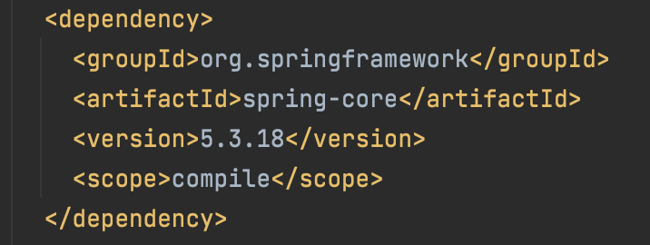
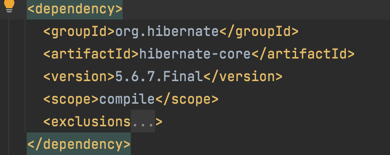
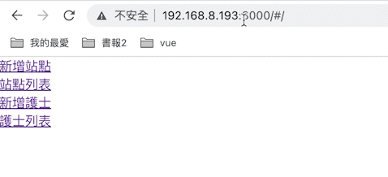
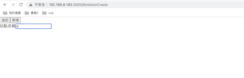
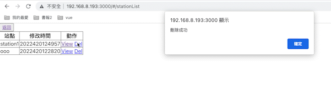
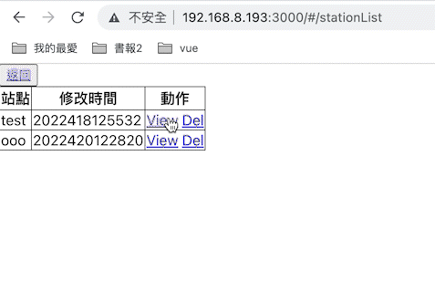
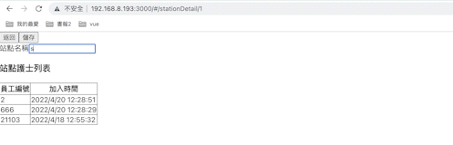
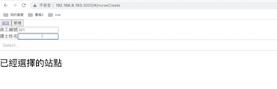
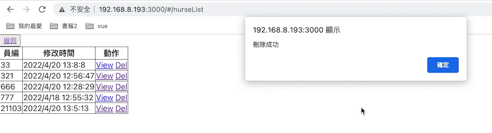
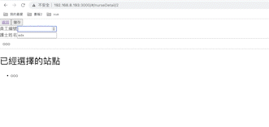

# stationManagement
station management

1. 修改`.env`
* 方便測試將前端的程式搬至此目錄的fronted資料夾
[原程式](https://github.com/wsx13767/station-management-fronted)

* 執行以下指令前先將目錄下的`.env`檔的IP改為本機的
```shell
  HOST_IP_ADDRESS=localhost
```
2. cmd
 * 執行docker composer
```shell
mvn clean install # 成功跑完test後，build出jar檔
docker-compose up -d
```

spring framework版本

hibernate 版本


> 在瀏覽器輸入`http://localhost:3000`,就能看到畫面
---
## 相關截圖
### 主畫面

### 站點新增

### 站點列表、刪除站點

### 至更新站點、更新名稱


### 新增護士

### 護士列表、刪除護士

### 更新護士資料
